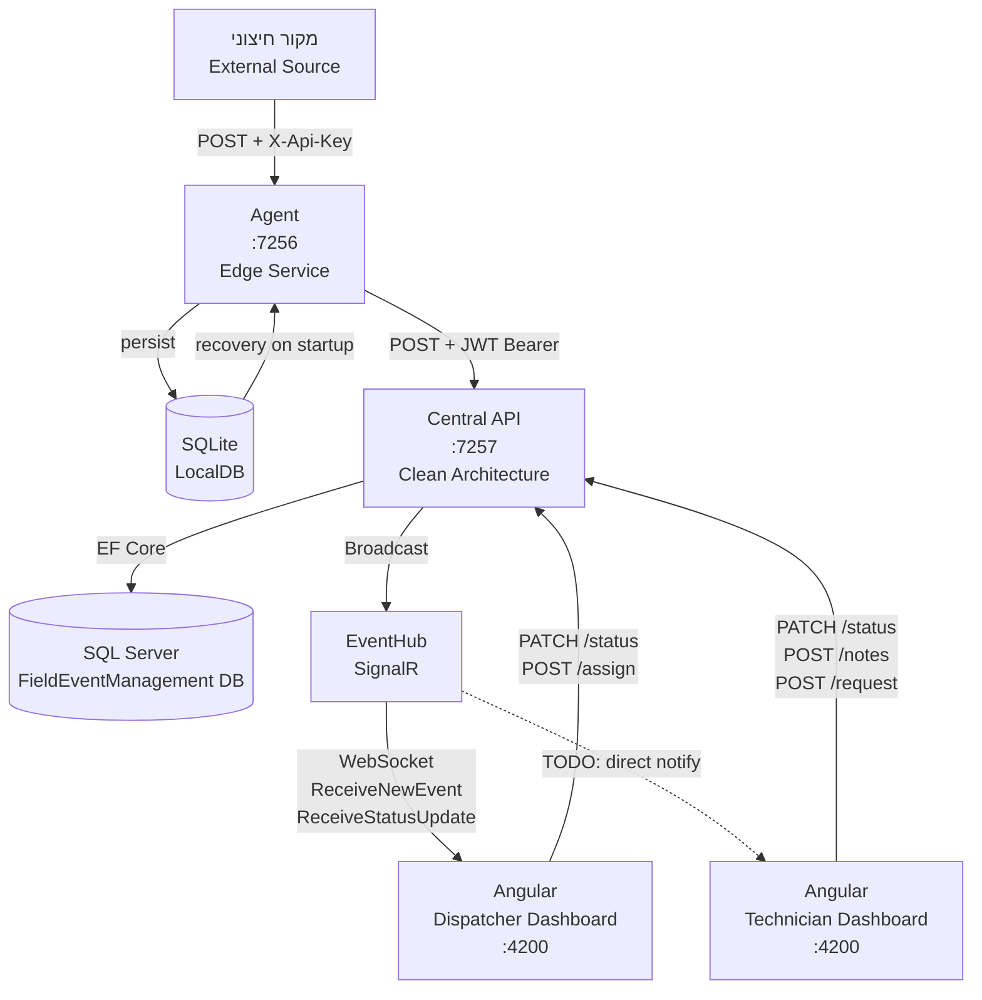
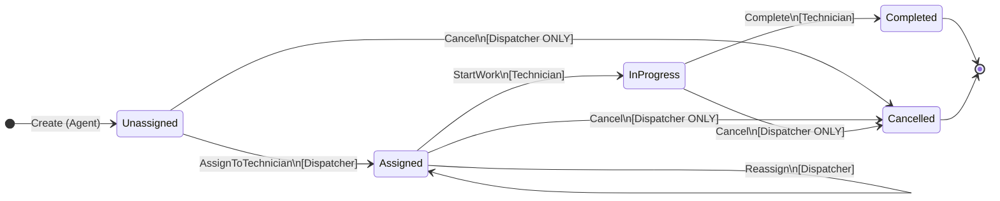

# מסמך ארכיטקטורה – Field Event Management System

> **גרסה:** 1.1 | **תאריך:** יולי 2026 | **מחבר:** ארכיטקט ראשי

---

## כלי AI שהשתמשתי בהם


| שלב                  | כלי               | שימוש                                                                     |
| -------------------- | ----------------- | ------------------------------------------------------------------------- |
| **תכנון ארכיטקטורה** | **Google Gemini** | בניית ארכיטקטורת המערכת, החלטות ארכיטקטוניות, הגדרת שכבות ו-State Machine |
| **כתיבת קוד**        | **Cursor**        | מימוש כל הקוד — שרת API, Agent, Angular, בדיקות                           |


> הארכיטקטורה תוכננה יחד עם Gemini, הקוד נכתב בסיוע Cursor IDE.

---

## כיסוי דרישות המבחן

המסמך הבא עונה על כל 8 הסעיפים שנדרשו, ומוסיף מעבר לנדרש:


| #   | דרישה מהמבחן                                       | סטטוס  | סעיף במסמך                        |
| --- | -------------------------------------------------- | ------ | --------------------------------- |
| 1   | תרשים ארכיטקטורה של כלל המערכת                     | ✅ כלול | §1 — ASCII + Mermaid flowchart    |
| 2   | תיאור כל רכיב ותפקידו                              | ✅ כלול | §2 — כל 7 הרכיבים עם טבלאות       |
| 3   | תיאור מפורט ה-Agent (קבלת אירועים + תקשורת עם שרת) | ✅ כלול | §3 — ASCII diagram מלא + Recovery |
| 4   | State Machine – מצבים ותרשים מעברים                | ✅ כלול | §4 — Mermaid stateDiagram + טבלה  |
| 5   | מודל נתונים (ERD / תיאור טבלאות)                   | ✅ כלול | §5 — ERD של SQL Server + SQLite   |
| 6   | מנגנון אבטחה ואימות                                | ✅ כלול | §6 — תרשים Auth + JWT + פגיעויות  |
| 7   | התנהגות כאשר רכיב אינו זמין                        | ✅ כלול | §7 — 5 תרחישי כשל + טבלת עמידות   |
| 8   | Trade-offs ובחירות                                 | ✅ כלול | §8 — 8 החלטות מנומקות             |


### מה הוספתי מעבר לנדרש במפורש


| תוספת                            | היכן       | ערך                                                     |
| -------------------------------- | ---------- | ------------------------------------------------------- |
| **Audit Trail מפורט**            | §4.4       | הסבר מדוע History הוא חלק מה-Aggregate ולא טבלה עצמאית  |
| **טבלת פגיעויות אבטחה**          | §6.4       | ניתוח 5 פגיעויות ידועות עם רמת חומרה (🔴🟠🟡)           |
| **Recovery on Restart**          | §3.4       | תיאור מנגנון שחזור ה-SQLite בהפעלה מחדש                 |
| **שכפול State Machine בצד לקוח** | §4.4       | הסבר הבחירה ב-TypeScript mirror + ההבדל מה-"אמת" בשרת   |
| **SignalR JWT via query string** | §6.3       | קטע קוד + הסבר מדוע זה נדרש ב-WebSocket                 |
| **Bounded Channel**              | §8.4       | הנמקה מדוע בחרתי גבול ולא Unbounded + overflow behavior |
| **נספח Production Readiness**    | סוף המסמך  | רשימת 10 פעולות נדרשות למעבר לסביבת Production          |
| **ניתוח Gap / WIP**              | §2 (הערות) | סימון מה הוא stub/TODO בקוד הקיים + חוסר עקביות roles   |


---

## תוכן עניינים

1. [תרשים ארכיטקטורה כולל](#1-תרשים-ארכיטקטורה-כולל)
2. [תיאור כל רכיב ותפקידו](#2-תיאור-כל-רכיב-ותפקידו)
3. [תיאור מפורט ה-Agent](#3-תיאור-מפורט-ה-agent)
4. [State Machine של האירוע](#4-state-machine-של-האירוע)
5. [מודל נתונים](#5-מודל-נתונים)
6. [מנגנון אבטחה ואימות](#6-מנגנון-אבטחה-ואימות)
7. [התנהגות בכשל רכיב](#7-התנהגות-בכשל-רכיב)
8. [Trade-offs ובחירות ארכיטקטוניות](#8-trade-offs-ובחירות-ארכיטקטוניות)

---

## 1. תרשים ארכיטקטורה כולל

```
╔══════════════════════════════════════════════════════════════════════════════════╗
║                        FIELD EVENT MANAGEMENT SYSTEM                            ║
╠══════════════════════════════════════════════════════════════════════════════════╣
║                                                                                  ║
║   ┌─────────────────────────────┐                                                ║
║   │      External Source        │  (מכשיר שטח / מערכת חיצונית)                 ║
║   └─────────────┬───────────────┘                                                ║
║                 │ POST /api/agent/events                                          ║
║                 │ Header: X-Api-Key                                               ║
║                 ▼                                                                 ║
║   ┌─────────────────────────────────────────────────────────┐                   ║
║   │                   AGENT (Edge Service)                   │ :7256             ║
║   │                                                         │                   ║
║   │  ┌──────────────┐   ┌───────────────┐  ┌────────────┐  │                   ║
║   │  │ Minimal API  │──▶│ EventChannel  │─▶│Background  │  │                   ║
║   │  │  Endpoint    │   │ (in-memory    │  │  Worker    │  │                   ║
║   │  └──────────────┘   │   Channel)    │  └─────┬──────┘  │                   ║
║   │                     └───────┬───────┘        │         │                   ║
║   │                             │ persist        │ forward │                   ║
║   │                     ┌───────▼───────┐        │         │                   ║
║   │                     │    SQLite     │        │         │                   ║
║   │                     │  (LocalDB)    │        │         │                   ║
║   │                     └───────────────┘        │         │                   ║
║   └───────────────────────────────────────────────┼─────────┘                   ║
║                                                   │ POST /api/events/receiveEvent ║
║                                                   │ Bearer JWT (Scheduler role)  ║
║                                                   ▼                             ║
║   ┌─────────────────────────────────────────────────────────────────────┐       ║
║   │                    CENTRAL API (Clean Architecture)                  │ :7257 ║
║   │                                                                     │       ║
║   │  ┌──────────────────────────────────────────────────────────────┐  │       ║
║   │  │  Presentation Layer  (Controllers)                           │  │       ║
║   │  │  AuthController | EventsController | TechnicianController    │  │       ║
║   │  └────────────────────────────┬─────────────────────────────────┘  │       ║
║   │                               │                                    │       ║
║   │  ┌────────────────────────────▼─────────────────────────────────┐  │       ║
║   │  │  Application Layer  (Use Cases)                              │  │       ║
║   │  │  EventReceiverService | TechnicianEventService               │  │       ║
║   │  └────────────────────────────┬─────────────────────────────────┘  │       ║
║   │                               │                                    │       ║
║   │  ┌────────────────────────────▼─────────────────────────────────┐  │       ║
║   │  │  Domain Layer  (Core)                                        │  │       ║
║   │  │  FieldEvent (Aggregate) | State Machine | EventStateHistory  │  │       ║
║   │  └────────────────────────────┬─────────────────────────────────┘  │       ║
║   │                               │                                    │       ║
║   │  ┌────────────────────────────▼─────────────────────────────────┐  │       ║
║   │  │  Infrastructure Layer                                        │  │       ║
║   │  │  EF Core → SQL Server | TokenService | EventHub (SignalR)    │  │       ║
║   │  └──────────────────────────────────────────────────────────────┘  │       ║
║   └─────────────────────────────────────────────────────┬───────────────┘       ║
║                                                         │                       ║
║           ┌─────────────────────────────────────────────┤                       ║
║           │ REST (HTTP/JSON)              SignalR (WS)  │                       ║
║           ▼                                    ▼        │                       ║
║   ┌──────────────────────────────────────────────────────┐                      ║
║   │              ANGULAR SPA (Frontend)   :4200          │                      ║
║   │                                                      │                      ║
║   │  ┌────────────────────┐  ┌──────────────────────┐   │                      ║
║   │  │  Dispatcher        │  │  Technician          │   │                      ║
║   │  │  Dashboard         │  │  Dashboard           │   │                      ║
║   │  └────────────────────┘  └──────────────────────┘   │                      ║
║   │  AuthService | SignalRService | EventStore (signals) │                      ║
║   └──────────────────────────────────────────────────────┘                      ║
╚══════════════════════════════════════════════════════════════════════════════════╝
```

### תרשים תקשורת מפושט (Mermaid)




---

## 2. תיאור כל רכיב ותפקידו

### 2.1 `FieldEventManagement.Core` — שכבת הדומיין

**תפקיד:** לב המערכת. מכיל את הלוגיקה העסקית הטהורה ללא תלות בתשתית.


| אלמנט                              | תיאור                                                                                                                      |
| ---------------------------------- | -------------------------------------------------------------------------------------------------------------------------- |
| `FieldEvent`                       | ה-Aggregate Root. מכיל את כל מחזור החיים של אירוע שטח — מיצירה, דרך הקצאה ועדכון מצב, ועד סיום. State Machine מובנה בתוכו. |
| `EventStatus`                      | Enum המייצג את כל מצבי האירוע האפשריים: `Unassigned`, `Assigned`, `InProgress`, `Completed`, `Cancelled`.                  |
| `EventStateHistory`                | ישות המתעדת כל מעבר מצב — Audit Trail בלתי ניתן לשינוי.                                                                    |
| `User`                             | ישות משתמש עם שם משתמש, סיסמה ותפקיד.                                                                                      |
| `InvalidFieldEventStateException`  | חריגה דומיינית הנזרקת על מעבר מצב לא חוקי.                                                                                 |
| `ITokenService`, `IUserRepository` | ממשקים (Ports) לשירות JWT ולמאגר משתמשים.                                                                                  |


**עיקרון ארכיטקטוני:** אפס תלות בחבילות חיצוניות (`net10.0` בלבד). שכבה זו אינה יודעת על בסיסי נתונים, HTTP, או SignalR.

---

### 2.2 `FieldEventManagement.Application` — שכבת היישום (Use Cases)

**תפקיד:** תיאום זרימות עסקיות. מתרגם פניות מה-Controllers לפעולות על הדומיין.


| אלמנט                          | תיאור                                                                                                       |
| ------------------------------ | ----------------------------------------------------------------------------------------------------------- |
| `EventReceiverService`         | מקבל אירועים מה-Agent: בדיקת idempotency → יצירת `FieldEvent` → שמירה → SignalR notification.               |
| `TechnicianEventService`       | מטפל בפעולות טכנאי: עדכון סטטוס, הוספת הערה, בקשת שיוך.                                                     |
| `IFieldEventRepository`        | Port לשמירה ושליפת אירועים מה-DB.                                                                           |
| `IRealTimeNotificationService` | P לשידורי SignalR — שכבת הייortשום אינה תלויה ב-SignalR ישירות.                                             |
| `DTOs`                         | אובייקטים להעברת נתונים: `FieldEventDto`, `UpdateStatusDto`, `AddNoteDto`, `WrappedEvent`, `ProcessResult`. |


---

### 2.3 `FieldEventManagement.Infrastructure` — שכבת התשתית

**תפקיד:** מימוש הממשקים שהוגדרו ב-Application ו-Core. כאן "נוגעים" בעולם החיצוני.


| אלמנט                         | תיאור                                                                                                                                            |
| ----------------------------- | ------------------------------------------------------------------------------------------------------------------------------------------------ |
| `ApplicationDbContext`        | EF Core DbContext. מגדיר מיפוי לטבלאות `FieldEvents`, `Users`, `EventStateHistory`. History נטענת כ-shadow field (`_history`) להגנת ה-aggregate. |
| `FieldEventRepository`        | מממש `IFieldEventRepository`. תומך ב-`ExistsAsync`, `GetByIdAsync`, `AddAsync`.                                                                  |
| `UserRepository`              | שליפת משתמש לפי שם משתמש.                                                                                                                        |
| `TokenService`                | יצירת JWT עם Claims (Name, Role) וחתימה סימטרית.                                                                                                 |
| `RealTimeNotificationService` | מממש `IRealTimeNotificationService`. מתרגם קריאות עסקיות לשידורי SignalR.                                                                        |
| `EventHub`                    | SignalR Hub. נקודת הקצה לחיבורי WebSocket. `[Authorize]` מחייב JWT תקין בחיבור.                                                                  |
| `DependencyInjection`         | Extension method המרשם את כל שירותי Infrastructure ב-DI Container.                                                                               |


---

### 2.4 `FieldEventManagement.API` — שכבת Presentation

**תפקיד:** חשיפת ה-Use Cases כ-HTTP API. ניהול DI, auth, CORS, ו-SignalR wiring.


| אלמנט                  | תיאור                                                                                      |
| ---------------------- | ------------------------------------------------------------------------------------------ |
| `AuthController`       | `POST /api/auth/login` — אימות משתמש והחזרת JWT.                                           |
| `EventsController`     | `POST /api/events/receiveEvent` — קבלת אירועים מה-Agent (דורש role `Scheduler`).           |
| `TechnicianController` | ניהול פעולות טכנאי: עדכון סטטוס, הוספת הערה, בקשת שיוך.                                    |
| `Program.cs`           | Composition Root: EF `EnsureCreated`, JWT auth, CORS, SignalR, Polly (via Infrastructure). |


---

### 2.5 `FieldEventManagement.Agent` — שירות Edge

ראה פרק 3 לפירוט מלא.

---

### 2.6 `field-event-app` — Angular SPA

**תפקיד:** ממשק משתמש לסדרן ולטכנאי.


| אלמנט               | תיאור                                                                          |
| ------------------- | ------------------------------------------------------------------------------ |
| `AuthService`       | Login ושמירת JWT ב-localStorage.                                               |
| `SignalRService`    | חיבור WebSocket ל-`/eventHub`. אוזן ל-`ReceiveNewEvent` ומוסר לסטור.           |
| `EventStore`        | מאגר מצב מקומי על בסיס Angular Signals. מרכז את רשימת האירועים.                |
| `EventFacade`       | מסך בין ה-Components לשירותים/סטור. מפשט את ה-API עבור הקומפוננטות.            |
| `EventStateMachine` | מראה TypeScript לשכפול לוגיקת המעברים מהשרת — מאפשר validation מקדים בצד לקוח. |
| `AuthGuard`         | שמירה על נתיבים מאובטחים.                                                      |


---

### 2.7 שכבות הבדיקה


| פרויקט                            | בדיקות                                                                        |
| --------------------------------- | ----------------------------------------------------------------------------- |
| `FieldEventManagement.Core.Tests` | 13 בדיקות xUnit: מעברי מצב חוקיים/לא חוקיים, ביטול עם/בלי הרשאה, הקצאת טכנאי. |
| `event-state-machine.spec.ts`     | בדיקות Jasmine לשכפול TS של ה-State Machine.                                  |


---

## 3. תיאור מפורט ה-Agent

ה-Agent הוא שירות Edge עצמאי (ASP.NET Core Hosted Service) שתפקידו לגשר בין מקורות אירוע חיצוניים לבין ה-API המרכזי. הוא מיועד לפעול גם כאשר ה-API אינו זמין.

### 3.1 ארכיטקטורת ה-Agent

```
 ┌──────────────────────────────────────────────────────────────────┐
 │                     Agent Process (:7256)                        │
 │                                                                  │
 │  ┌────────────────────────────────┐                              │
 │  │     Minimal API Endpoint       │                              │
 │  │  POST /api/agent/events        │                              │
 │  │  ① Validate X-Api-Key         │                              │
 │  │  ② Deserialize FieldEventDto   │                              │
 │  │  ③ EventChannel.AddEventAsync  │                              │
 │  │  ④ Return 202 Accepted         │                              │
 │  └───────────────┬────────────────┘                              │
 │                  │                                               │
 │                  ▼                                               │
 │  ┌────────────────────────────────────────────────────────────┐  │
 │  │                     EventChannel                           │  │
 │  │                                                            │  │
 │  │  AddEventAsync(dto):                                       │  │
 │  │    1. Wrap → WrappedEvent { Id=Guid.NewGuid(), Data=dto }  │  │
 │  │    2. SQLite INSERT (Status=Pending)          ──────────┐  │  │
 │  │    3. Channel.Writer.TryWrite(wrappedEvent)             │  │  │
 │  │                                                         │  │  │
 │  │  On Startup Recovery:                         ┌─────────┘  │  │
 │  │    SELECT * WHERE Status='Pending'             │            │  │
 │  │    → re-enqueue into Channel                  ▼            │  │
 │  │                                         ┌──────────┐       │  │
 │  │  ConfirmDelivery(id):                   │  SQLite  │       │  │
 │  │    → DELETE from LocalEvents            │ LocalDB  │       │  │
 │  │                                         └──────────┘       │  │
 │  │  MoveToError(id):                                          │  │
 │  │    → UPDATE Status='Error'                                 │  │
 │  └────────────────────────────────┬───────────────────────────┘  │
 │                                   │ Channel.Reader                │
 │                                   ▼                               │
 │  ┌────────────────────────────────────────────────────────────┐  │
 │  │              AgentBackgroundWorker                         │  │
 │  │                                                            │  │
 │  │  await foreach (event in Channel):                         │  │
 │  │    ProcessSingleEventWithRetryAsync(event)                 │  │
 │  │      ├─ attempt 1 → wait 10s on fail                       │  │
 │  │      ├─ attempt 2 → wait 30s on fail                       │  │
 │  │      ├─ attempt 3 → wait 60s on fail                       │  │
 │  │      └─ attempt 4+ → wait 5min on fail (cap)               │  │
 │  │                                                            │  │
 │  │  HTTP 2xx → ConfirmDelivery (DELETE SQLite)                │  │
 │  │  HTTP 400/422 → MoveToError (poison message)               │  │
 │  │  HTTP 5xx → retry with backoff                             │  │
 │  │  Network error → retry with backoff                        │  │
 │  │                                                            │  │
 │  │  Parallel: RunCleanupLoopAsync                             │  │
 │  │    every 24h → DELETE expired Error/Completed rows         │  │
 │  └────────────────────────────────┬───────────────────────────┘  │
 │                                   │                               │
 └───────────────────────────────────┼───────────────────────────────┘
                                     │ HTTPS POST
                                     ▼
                    ┌──────────────────────────────┐
                    │         BackendClient         │
                    │  SendEventToBackendAsync()    │
                    │  ↑ JwtAuthHandler             │
                    │    (auto-login, cache JWT,    │
                    │     retry on 401)             │
                    │  ↑ AddStandardResilienceHandler│
                    │    (Polly: timeouts, retries) │
                    └──────────────────────────────┘
```

### 3.2 כיצד ה-Agent מקבל אירועים

1. **קבלה:** מקור חיצוני שולח `POST /api/agent/events` עם header `X-Api-Key`.
2. **אימות:** ה-Minimal API מוודא שה-Key תואם ל-`AgentSettings:ExpectedApiKey`.
3. **עטיפה:** ה-DTO נעטף ב-`WrappedEvent` עם `Guid` ייחודי (לצורך idempotency) וחותמת זמן.
4. **שמירה מקדימה:** הרשומה נשמרת ב-SQLite עם `Status=Pending` **לפני** הכנסתה לתור הזיכרון.
5. **הכנסה לתור:** `Channel.Writer.TryWrite()` מאפשר קריאה א-סינכרונית ל-`BackgroundWorker`.
6. **תגובה:** HTTP 202 מוחזר מיד לשולח — ה-Agent לא "תלוי" בהצלחת ה-API.

### 3.3 כיצד ה-Agent מתקשר עם השרת


| שלב              | פעולה                                                                                                                                                      |
| ---------------- | ---------------------------------------------------------------------------------------------------------------------------------------------------------- |
| **Auth**         | `JwtAuthHandler` (DelegatingHandler) מתחבר אוטומטית ל-`/api/auth/login` של ה-API עם credentials מ-`BackendAuth:Username/Password`. מאחסן את ה-JWT ב-cache. |
| **שליחה**        | `BackendClient.SendEventToBackendAsync()` שולח `POST /api/events/receiveEvent` עם `WrappedEvent` ב-JSON.                                                   |
| **Retry on 401** | אם ה-JWT פג תוקף, `JwtAuthHandler` מרענן אוטומטית ומנסה שוב.                                                                                               |
| **Polly**        | `AddStandardResilienceHandler()` מוסיף Retry, Timeout ו-Circuit Breaker ברמת ה-HttpClient.                                                                 |
| **Backoff**      | `AgentBackgroundWorker` מנהל Exponential Backoff עצמאי: 10s → 30s → 60s → 5min.                                                                            |


### 3.4 Recovery בהפעלה מחדש

בעת הפעלת ה-Agent לאחר כשל/restart, `EventChannel` שולף מ-SQLite את כל הרשומות עם `Status=Pending` ומכניסן מחדש לתור. כך **אין אובדן נתונים** גם אם ה-Agent קרס בין קבלת האירוע לשליחתו.

#### מנגנון ניקוי (Cleanup)

`RunCleanupLoopAsync` מריץ מחיקה כל 24 שעות, ומוחק **רק** שורות עם:
- `Status = Error` שגילן עולה על `DeleteErrorAfterHours` (ברירת מחדל: 168 שעות = 7 ימים)
- `Status = Completed` שגילן עולה על `DeleteCompletedAfterHours` (ברירת מחדל: 24 שעות)

שורות עם `Status = Pending` **לעולם אינן נמחקות** — הן יישארו בדיסק עד שיישלחו בהצלחה.

> **הערת Production:** ב-Production מומלץ להוסיף ניטור על שורות `Error` שמתגדלות ולא מטופלות, התראה (Alert) אם מספר שורות `Error` חצה סף מוגדר, ו-Dead Letter Queue ייעודי לאירועים שנכשלו באופן קבוע.

---

## 4. State Machine של האירוע

### 4.1 מצבים


| מצב          | משמעות                                                           |
| ------------ | ---------------------------------------------------------------- |
| `Unassigned` | **מצב ראשוני.** האירוע התקבל אך לא הוקצה לטכנאי.                 |
| `Assigned`   | הוקצה לטכנאי ספציפי. ניתן להעביר לטכנאי אחר (Assigned→Assigned). |
| `InProgress` | הטכנאי החל בטיפול.                                               |
| `Completed`  | הטיפול הושלם. **מצב סופי (טרמינל).**                             |
| `Cancelled`  | האירוע בוטל. **מצב סופי (טרמינל).** רק Dispatcher מורשה.         |


### 4.2 תרשים מעברים




### 4.3 כללי המעברים (טבלה)


| מ / אל         | Unassigned | Assigned      | InProgress | Completed | Cancelled |
| -------------- | ---------- | ------------- | ---------- | --------- | --------- |
| **Unassigned** | —          | ✅             | ❌          | ❌         | ✅ *       |
| **Assigned**   | ❌          | ✅ (re-assign) | ✅          | ❌         | ✅ *       |
| **InProgress** | ❌          | ❌             | —          | ✅         | ✅ *       |
| **Completed**  | ❌          | ❌             | ❌          | —         | ❌         |
| **Cancelled**  | ❌          | ❌             | ❌          | ❌         | —         |


> ✅ * ביטול מותר **רק** כאשר `actingRole == "Dispatcher"` (case-insensitive). כל ניסיון ביטול על ידי תפקיד אחר זורק `InvalidFieldEventStateException`.

### 4.4 אכיפה ארכיטקטונית

- **מיקום הלוגיקה:** הנמצאת **אך ורק** ב-`FieldEvent.TransitionTo()` בשכבת Core.
- **private set על כל Property:** מונע שינוי מצב ישיר מבחוץ — ניתן לשנות רק דרך `TransitionTo` ו-`AssignToTechnician`.
- **Audit Trail:** כל מעבר מצב מוסיף רשומה ל-`EventStateHistory` עם `ChangedBy` וחותמת זמן.
- **שכפול בצד לקוח:** `EventStateMachine` ב-TypeScript (Angular) משכפל את טבלת המעברים לאימות מקדים בלבד — ה-"אמת" תמיד בשרת.

---

## 5. מודל נתונים

### 5.1 ERD

```
┌──────────────────────────────────────────────────────────────────┐
│                        SQL Server DB                             │
│                                                                  │
│  ┌──────────────────────────────┐                               │
│  │          FieldEvents          │                               │
│  ├──────────────────────────────┤                               │
│  │ Id              UNIQUEIDENTIFIER  PK                         │
│  │ Title           NVARCHAR(200)     NOT NULL                   │
│  │ Description     NVARCHAR(MAX)                                │
│  │ Source          NVARCHAR(MAX)                                │
│  │ Location        NVARCHAR(MAX)                                │
│  │ Status          INT               NOT NULL  (0-4 = enum)    │
│  │ AssignedTech.Id NVARCHAR(MAX)     NULL                       │
│  │ CreatedAt       DATETIME2         NOT NULL                   │
│  └──────────────────┬───────────────┘                           │
│                     │ 1                                          │
│                     │                                            │
│                     │ N                                          │
│  ┌──────────────────▼───────────────┐                           │
│  │       EventStateHistory          │                           │
│  ├──────────────────────────────────┤                           │
│  │ Id             UNIQUEIDENTIFIER  PK                          │
│  │ FieldEventId   UNIQUEIDENTIFIER  FK → FieldEvents.Id         │
│  │ Status         INT               NOT NULL                    │
│  │ ChangedBy      NVARCHAR(MAX)     NOT NULL                    │
│  │ Timestamp      DATETIME2         NOT NULL                    │
│  └──────────────────────────────────┘                           │
│                                                                  │
│  ┌──────────────────────────────┐                               │
│  │            Users             │                               │
│  ├──────────────────────────────┤                               │
│  │ Id           UNIQUEIDENTIFIER  PK                            │
│  │ Username     NVARCHAR(MAX)     NOT NULL  (unique assumed)     │
│  │ PasswordHash NVARCHAR(MAX)     NOT NULL                      │
│  │ Role         NVARCHAR(MAX)     NOT NULL  (Scheduler|Tech.)   │
│  └──────────────────────────────┘                               │
└──────────────────────────────────────────────────────────────────┘

┌──────────────────────────────────────────────────────────────────┐
│                     SQLite DB (Agent)                            │
│                                                                  │
│  ┌──────────────────────────────┐                               │
│  │         LocalEvents          │                               │
│  ├──────────────────────────────┤                               │
│  │ Id        TEXT  PK  (Guid)                                   │
│  │ Payload   TEXT  NOT NULL  (JSON: WrappedEvent)               │
│  │ Status    TEXT  NOT NULL  (Pending|Error|Completed)          │
│  │ CreatedAt TEXT  NOT NULL  (ISO 8601)                         │
│  └──────────────────────────────┘                               │
│  INDEX: IX_LocalEvents_Status_CreatedAt                         │
└──────────────────────────────────────────────────────────────────┘
```

### 5.2 הסבר מבנה הנתונים

`**FieldEvent**` הוא Aggregate Root. ה-`EventStateHistory` הוא collection פנימי שנטען דרך EF Core עם field-backed property (`_history`). הבחירה להכניס את ה-History כחלק מה-Aggregate מבטיחה שכל מעבר מצב תמיד מלווה ברשומת היסטוריה — Atomic ואינן נפרדות.

`**Users**` — טבלה פשוטה ללא FK לאירועים. `AssignedTechnicianId` ב-`FieldEvent` הוא string ולא FK — בחירה מכוונת לאפשר גמישות (ייתכן שה-ID מגיע ממערכת HR חיצונית).

**SQLite (Agent)** — אחסון מקומי בפורמט JSON ל-`WrappedEvent`. אין schema מורכב — מטרתו רק durability לאירועים בדרך.

---

## 6. מנגנון אבטחה ואימות

### 6.1 תרשים אבטחה

```
External Source ──[X-Api-Key header]──────────────────▶ Agent
                                                        │
                                              validates against
                                         AgentSettings:ExpectedApiKey

Agent ──[POST /api/auth/login (username+password)]────▶ API / AuthController
                                                        │
                                              UserRepository.GetByUsernameAsync()
                                              compares PasswordHash == password
                                                        │
                                              TokenService.GenerateToken(user)
                                              HS256 JWT { Name, Role, exp }
                                                        │
                                              ◀── { token: "eyJ..." } ──────────

Agent ──[Authorization: Bearer <JWT>]─────────────────▶ EventsController
                                                        │ [Authorize(Roles="Scheduler")]

Angular ──[POST /api/auth/login]──────────────────────▶ AuthController
         ◀── { token } ──────────────────────────────── 
         stores in localStorage

Angular ──[Authorization: Bearer <JWT>]───────────────▶ TechnicianController
                                                        │ [Authorize(Roles="Technician")]

Angular ──[WebSocket + ?access_token=<JWT>]───────────▶ EventHub (SignalR)
                                                        │ [Authorize] at Hub level
                                                        │ invoke JoinSchedulerGroup()
                                                        │ [Authorize(Roles="Scheduler")]
```

### 6.2 JWT — פרטי מימוש


| פרמטר             | ערך                                                                    |
| ----------------- | ---------------------------------------------------------------------- |
| Algorithm         | HMAC SHA-256 (symmetric)                                               |
| Issuer / Audience | לא מוגדרים (פגיעות — ראה Trade-offs)                                   |
| Token lifetime    | 2 ימים (`AddDays(2)` בקוד)                                             |
| Key               | מ-`appsettings.json:Jwt:Key` (32 תווים)                                |
| Claims            | `ClaimTypes.Name` (Username), `ClaimTypes.Role` (Scheduler/Technician) |


### 6.3 SignalR — אבטחת חיבור WebSocket

JWT לא נשלח ב-Header בחיבור WebSocket (מגבלת browsers). לכן ה-API מחלץ את ה-token מ-query parameter `?access_token=`. פעולה זו מוגדרת ב-`Program.cs`:

```csharp
options.Events = new JwtBearerEvents
{
    OnMessageReceived = context =>
    {
        var token = context.Request.Query["access_token"];
        var path = context.HttpContext.Request.Path;
        if (!string.IsNullOrEmpty(token) && path.StartsWithSegments("/EventHub"))
            context.Token = token;
        return Task.CompletedTask;
    }
};
```

### 6.4 בחירות מכוונות לסביבת פיתוח (Dev-Only Decisions)

> **הערה:** פרויקט זה הוא **סביבת פיתוח ומבחן בלבד**. כל הסיסמאות, המפתחות וה-credentials החשופים הם ערכי DEV מכוונים. ההחלטות הבאות מתאימות לסביבה זו ואינן מייצגות חולשה ארכיטקטונית.


| בחירה                                   | מיקום              | הסבר בהקשר DEV                                                    | שינוי לפרודקשן                                        |
| --------------------------------------- | ------------------ | ----------------------------------------------------------------- | ----------------------------------------------------- |
| `PasswordHash == password` (plain-text) | `UserRepository`   | נוח לפיתוח — אפשר להוסיף משתמשים ישירות ל-DB ללא hashing          | BCrypt/Argon2                                         |
| JWT Key ב-`appsettings.json`            | `appsettings.json` | מאפשר הפעלה מיידית ללא הגדרת secrets                              | Azure Key Vault / env vars                            |
| `InsecureClient` (SSL bypass)           | `Agent/Program.cs` | נדרש ב-dev כי ה-cert של `localhost:7257` הוא self-signed          | מוסר בפרודקשן — הקוד כבר מתנה: `if (IsDevelopment())` |
| `BackendAuth` credentials ב-appsettings | `appsettings.json` | ה-Agent צריך credentials כדי לעשות login — ב-dev זה נוח           | env vars / secrets store                              |
| Issuer/Audience מוגדרים (תקין)          | `TokenService`     | ✅ `ValidateIssuer=true`, `ValidateAudience=true` — כבר מוגדר נכון | ללא שינוי                                             |


---

## 7. התנהגות בכשל רכיב

### 7.1 כשל API המרכזי

**השפעה:** ה-Agent אינו יכול לשלוח אירועים.

**מנגנון עמידות:**

1. ה-Agent ממשיך לקבל אירועים מהמקור החיצוני (HTTP 202 מוחזר מיד).
2. כל אירוע נשמר ב-SQLite עם `Status=Pending` **לפני** הכנסתו לתור.
3. `AgentBackgroundWorker` מנסה שוב עם Exponential Backoff: 10s → 30s → 60s → 5min.
4. ה-Channel הוא Bounded (גבול מ-`ChannelCapacity: 10000`). אם מתמלא — `TryWrite` יכשל.
5. בעת חזרת ה-API — ה-Worker ממשיך אוטומטית ושולח את כל הממתינים.
6. אם ה-Agent עצמו נופל בזמן זה — **Recovery on startup**: SQLite לא נמחק, בהפעלה מחדש כל ה-`Pending` מוכנסים מחדש.

```
API כבוי ─────────────────────────────────── API חוזר
    │                                              │
    ▼                                              ▼
Agent: SQLite.Pending + Backoff ────────── Worker ממשיך לשלוח
```

---

### 7.2 כשל Agent

**השפעה:** אירועים חדשים אינם מתקבלים מהמקור החיצוני.

**מנגנון עמידות:**

1. ה-API ממשיך לפעול — אירועים קיימים ניתנים לניהול על ידי טכנאים.
2. לאחר restart — Agent משחזר את כל ה-`Pending` מ-SQLite.

---

### 7.3 כשל SQL Server (Central DB)

**השפעה:** ה-API אינו יכול לקרוא/לכתוב אירועים.

**מנגנון עמידות:**

1. ה-API מחזיר שגיאת 500 לבקשות שדורשות DB.
2. ה-Agent מקבל 5xx → מפעיל backoff ומנסה שוב.
3. אין read-through cache — אין עמידות מלאה ב-read path.
4. לאחר שחזור ה-DB — ה-API ממשיך לעבוד, ה-Agent שולח את הממתינים.

---

### 7.4 כשל SignalR / EventHub

**השפעה:** עדכונים real-time אינם מגיעים ל-Angular.

**מנגנון עמידות:**

1. הכשל **לא משפיע** על קבלת אירועים מה-Agent (SignalR notification הוא fire-and-forget ב-`EventReceiverService`).
2. ה-Angular client משתמש ב-`withAutomaticReconnect()` — ינסה להתחבר מחדש.
3. עדכונים שהתרחשו בזמן הניתוק **אינם מתקבלים** — אין מנגנון catch-up/sync. בפרודקשן: נדרש endpoint של polling או SSE כגיבוי.

---

### 7.5 כשל Angular (Client)

**השפעה:** משתמשים אינם יכולים לגשת ל-UI. ה-API, Agent ו-DB פועלים ללא הפרעה.

---

### 7.6 סיכום עמידות


| תרחיש           | אובדן נתונים   | המשך קבלה     | שחזור אוטומטי      |
| --------------- | -------------- | ------------- | ------------------ |
| API כבוי        | ❌ אין          | ✅ Agent ממשיך | ✅ כן (backoff)     |
| Agent כבוי      | ❌ אין (SQLite) | ❌ עצור        | ✅ כן (recovery)    |
| SQL Server כבוי | ❌ אין          | ❌ עצור        | ✅ כן               |
| SignalR כבוי    | ❌ אין          | ✅ ממשיך       | ✅ (AutoReconnect)  |
| Angular כבוי    | ❌ אין          | ✅ ממשיך       | ✅ (Browser reload) |


---

## 8. Trade-offs ובחירות ארכיטקטוניות

### 8.0 ניתוח חלופות — בחירות ארכיטקטוניות מרכזיות

---

#### א. ארכיטקטורת ה-Agent: Background Worker עם SQLite — מול חלופות

##### החלופות שנשקלו

**חלופה 1: Message Queue (RabbitMQ / Azure Service Bus / Kafka)**

```
External → RabbitMQ Queue → Consumer Service → API
```


| יתרון                               | חסרון                                               |
| ----------------------------------- | --------------------------------------------------- |
| Dead Letter Queue מובנה             | תלות בתשתית חיצונית — RabbitMQ/Kafka חייבים לרוץ    |
| Horizontal scaling (מספר consumers) | מורכבות תפעולית גבוהה — לא מתאים ל-Edge device      |
| Ordering guarantees (Kafka)         | ה-Edge device חייב קישוריות לתשתית המרכזית בכל עת   |
| Fan-out אל מספר שירותים             | אין דורה מקומית — אם הרשת לא זמינה, ה-queue לא נגיש |


**חלופה 2: Python Agent**

```python
# agent.py
import sqlite3, requests, time

def run():
    while True:
        events = db.get_pending()
        for e in events:
            try: 
                requests.post(API_URL, json=e)
                db.confirm(e.id)
            except: 
                time.sleep(30)
```


| יתרון                        | חסרון                                                    |
| ---------------------------- | -------------------------------------------------------- |
| פשוט לכתיבה מהירה            | אין type safety, אין DI, אין הפרדת שכבות                 |
| `requests` library מוכרת     | אין IHostedService — צריך לנהל thread pool ידנית         |
| Scripting מהיר               | Packaging ל-Edge devices מורכב יותר מ-.NET single binary |
| לאו דווקא עדיף ב-concurrency | `asyncio` יפה אך מוסיף מורכבות ל-error handling          |

> **הערה:** Python Agent הוצגה כחלופה תיאורטית להשוואה. אין לי ניסיון מעשי ב-Python ולכן לא מדובר בהשוואה מבוססת ניסיון אישי, אלא בניתוח יתרונות/חסרונות ברמת השפה והפלטפורמה.

**חלופה 3 (הבחירה שלי): .NET Background Worker + SQLite**

```
External → Minimal API → EventChannel → SQLite (Persist) → BackgroundWorker → API
                                      ↘ in-memory Channel ↗
```


| יתרון                       | הנמקה                                                               |
| --------------------------- | ------------------------------------------------------------------- |
| **Self-contained**          | ה-Agent הוא binary אחד, ללא תלות בתשתית חיצונית                     |
| **Durability מובנית**       | SQLite על הדיסק המקומי — עובד גם ללא רשת                            |
| **Type Safety**             | אותה שפה כמו ה-API — DTO מקומפל, לא string parsing                  |
| `**IHostedService`**        | .NET מנהל את ה-lifecycle (startup, graceful shutdown, cancellation) |
| **Exponential Backoff**     | לוגיקת retry מדורגת בלי ספריות חיצוניות                             |
| **Recovery on Restart**     | SQLite שורד crash — `GetPendingEvents()` מחזיר הכל                  |
| **Circuit Breaker (Polly)** | מובנה ב-`AddStandardResilienceHandler` — ללא קוד נוסף               |


**מסקנה:** ל-Edge Agent שאמור לעבוד גם offline, ה-Background Worker עם SQLite מספק את **כל** יתרונות ה-Message Queue (durability, retry, DLQ) — ללא תלות בתשתית. Python יכול להגיע לאותה תוצאה אך ידרוש יותר "ידניות" — אין DI, אין hosted service lifecycle, אין Polly.

---

#### ב. SQLite כאחסון מקומי — מול חלופות

##### החלופות שנשקלו

**חלופה 2: קובץ JSON / קובץ טקסט**

```csharp
// append to file
File.AppendAllText("events.jsonl", JsonSerializer.Serialize(event) + "\n");
```


| יתרון             | חסרון                                                      |
| ----------------- | ---------------------------------------------------------- |
| פשוט              | אין atomicity — crash בין כתיבה לקריאה עלול לשבור את הקובץ |
| ניתן לקריאה ידנית | אין transactions, אין index, סריקה ליניארית לכל recovery   |
| אין תלות          | אין מנגנון UPDATE/DELETE — צריך לממש ידנית                 |


**חלופה 3 (הבחירה שלי): SQLite**

```sql
CREATE TABLE LocalEvents (
    Id TEXT PRIMARY KEY,
    Payload TEXT NOT NULL,
    Status TEXT NOT NULL,  -- Pending | Error | Completed
    CreatedAt TEXT NOT NULL
);
CREATE INDEX IX_LocalEvents_Status_CreatedAt ON LocalEvents (Status, CreatedAt);
```


| יתרון                    | הנמקה                                                             |
| ------------------------ | ----------------------------------------------------------------- |
| **Atomic transactions**  | INSERT + status update הם transactional — אין partial writes      |
| **WAL mode**             | Write-Ahead Log מאפשר כתיבות מהירות וקריאות מקבילות               |
| **SELECT/UPDATE/DELETE** | מנגנוני ניהול Status מובנים ללא קוד בפנים                         |
| **Index**                | `IX_LocalEvents_Status_CreatedAt` — recovery מהיר גם ל-100K שורות |
| **אפס server**           | קובץ אחד על הדיסק, לא דורש process נפרד                           |
| **Cross-platform**       | `Microsoft.Data.Sqlite` — עובד על Windows/Linux/ARM               |


**מסקנה:** SQLite מספק את כל הנדרש לשכבת durability של Agent — atomic writes, מנגנון status מובנה, recovery מהיר — ב-zero infrastructure cost. זו הבחירה הטבעית לכל Edge device.

---

#### ג. Clean Architecture — מול חלופות

##### ה-3 גישות שנשקלו

**גישה 1: Traditional Layered Architecture (ה"קלאסי")**

```
┌─────────────────────────────┐
│   Presentation (Controllers)│
├─────────────────────────────┤
│   Business Logic (Services) │
├─────────────────────────────┤
│   Data Access (Repositories)│
├─────────────────────────────┤
│   Database                  │
└─────────────────────────────┘
```

**מה זה אומר בפועל:**

- Controller קורא ל-Service
- Service קורא ל-Repository ישירות
- Repository הוא `class EventRepository : DbContext` ישיר
- אין interfaces — `Service` תלוי ב-`Repository` קונקרטי


| יתרון              | חסרון                                                       |
| ------------------ | ----------------------------------------------------------- |
| פשוט ומוכר לכולם   | שכבת DB "עולה" לכל הדרך — Domain לא יכול לבצע לוגיקה ללא DB |
| מהיר לפיתוח ראשוני | בדיקות דורשות DB אמיתי או mocking מורכב                     |
|                    | **State Machine חי ב-Service** — לא ב-Domain, קשה לבדוק     |
|                    | תלות הפוכה: Domain תלוי ב-Infrastructure                    |


**גישה 2: Vertical Slice Architecture**

```
┌──────────────┐  ┌──────────────┐  ┌──────────────┐
│ReceiveEvent/ │  │UpdateStatus/ │  │  AddNote/    │
│  Command.cs  │  │  Handler.cs  │  │  Handler.cs  │
│  Handler.cs  │  │  Validator   │  │  Validator   │
│  Validator   │  │  Repository  │  │  Repository  │
│  Repository  │  └──────────────┘  └──────────────┘
└──────────────┘
```

כל "use case" הוא slice אנכי עצמאי — הכל יחד בתיקייה אחת.


| יתרון                                         | חסרון                                                |
| --------------------------------------------- | ---------------------------------------------------- |
| כל feature עצמאי — אפשר לשנות בלי לשבור אחרים | **שיתוף קוד** בין slices דורש מיומנות — נוטה לכפילות |
| קל לאתר קוד לפי feature                       | State Machine — איפה חי? בכל handler בנפרד?          |
| מתאים מאוד למדיאטור (MediatR)                 | חלוקת אחריות עולמית (auth, logging) פחות ברורה       |
| Scale טוב מאוד בצוות גדול                     | מורכב להסביר למי שלא מכיר את הגישה                   |


**גישה 3 (הבחירה שלי): Clean Architecture**

```
Core (Domain)          ← אפס תלויות
    ↑
Application            ← תלוי רק ב-Core
    ↑
Infrastructure         ← מממש interfaces מ-Application/Core
    ↑
API (Presentation)     ← מרכיב הכל
```

**מה מייחד אותה בפרויקט הזה:**


| החלטה                    | ביטוי בקוד                                              | הנמקה                                     |
| ------------------------ | ------------------------------------------------------- | ----------------------------------------- |
| **State Machine ב-Core** | `FieldEvent.TransitionTo()` ב-`Core` project            | בדיקות על הדומיין ללא DB, ללא HTTP        |
| **Ports & Adapters**     | `IFieldEventRepository`, `IRealTimeNotificationService` | Application לא יודע על EF Core או SignalR |
| **Domain Exceptions**    | `InvalidFieldEventStateException` ב-Core                | Exception "מדברת" בשפה עסקית, לא טכנית    |
| **Aggregate Protection** | `private set` על כל Properties                          | אי אפשר לשבור State Machine מבחוץ         |


**השוואה ישירה לגישות האחרות:**


| קריטריון                      | Traditional | Vertical Slice | Clean Architecture |
| ----------------------------- | ----------- | -------------- | ------------------ |
| בדיקות State Machine ללא DB   | ❌           | ⚠️             | ✅                  |
| הפרדת Domain מ-Infrastructure | ❌           | ⚠️             | ✅                  |
| קל להוסיף feature חדש         | ✅           | ✅              | ⚠️                 |
| גמישות להחלפת DB/SignalR      | ❌           | ⚠️             | ✅                  |
| Onboarding מהיר לפרויקט       | ✅           | ⚠️             | ⚠️                 |
| מתאים ל-State Machine מורכב   | ❌           | ⚠️             | ✅                  |


**מסקנה:** Clean Architecture מנצחת כאן **בגלל ה-State Machine**. כשה-Domain עשיר — עם Aggregate Roots, history, validation rules — הוא חייב לחיות בשכבה ללא תלויות. Vertical Slice היה מחייב לשכפל את ה-State Machine בכל handler, Traditional היה מכניס אותו ל-Service שתלוי ב-DbContext.

---

### 8.1 Clean Architecture vs. Simplicity

**בחירה:** Clean Architecture עם 4 שכבות (Core → Application → Infrastructure → API).

**הנמקה:** הדרישה כוללת State Machine מורכב, real-time, ו-Edge Agent. הפרדת הדומיין מהתשתית מאפשרת:

- בדיקת State Machine ללא DB (בדיקות ב-`Core.Tests` אינן דורשות Entity Framework).
- החלפת SignalR ב-gRPC streaming ללא שינוי ב-Use Cases.
- הוספת Kafka/RabbitMQ ב-Infrastructure ללא נגיעה ב-Core.

**Trade-off:** תוספת boilerplate (DTOs, interfaces, extension methods). לפרויקט קטן — over-engineering אפשרי. לפרויקט צומח — ההשקעה מוצדקת.

---

### 8.3 Exponential Backoff ב-Agent vs. Message Queue (RabbitMQ/Kafka)

**בחירה:** Backoff מובנה ב-Worker (10s → 30s → 60s → 5min).

**הנמקה:** פשטות — אין תלות בתשתית חיצונית. מתאים לסביבת Edge עם משאבים מוגבלים.

**Trade-off:** אין Dead Letter Queue רשמי (רק SQLite Error status). ב-Production עם volume גבוה — Message Broker יתן DLQ, ordering guarantees ו-horizontal scaling.

---

### 8.4 Bounded Channel vs. Unbounded

**בחירה:** `ChannelCapacity: 10000` — תור מוגבל.

**הנמקה:** מונע memory exhaustion בעת כשל ממושך של ה-API. כאשר התור מלא, אירועים חדשים **לא נמחקים** — הם כבר ב-SQLite עם `Status=Pending` וימתינו ל-restart או לפינוי.

**Trade-off:** לקוחות המשלחים אחרי שהתור מלא יקבלו שגיאה (אם `TryWrite` נכשל). פתרון עתידי: Overflow policy configurable.

---

### 8.5 SignalR Groups ("Schedulers") vs. Direct User Connection

**בחירה:** שידור לכל הסדרנים ב-Group, ולא ל-Connection ספציפי.

**הנמקה:** פשוט לממש ואינו דורש ניהול מיפוי UserId → ConnectionId.

**Trade-off:** אין שידור ישיר לטכנאי ספציפי (TODO בקוד). ב-Production: לשמור `Dictionary<string, string> userIdToConnectionId` ב-Hub או להשתמש ב-SignalR User Groups.

---

### 8.6 EnsureCreated vs. Migrations

**בחירה:** `Database.EnsureCreated()` בהפעלה.

**הנמקה:** פשטות לפיתוח — אין צורך בניהול migration files.

**Trade-off:** לא מתאים ל-Production. אינו תומך ב-schema evolution. ב-Production: `dotnet ef migrations add` + `migrate()` בCI/CD pipeline.

---

### 8.7 JWT Symmetric Key vs. Asymmetric (RS256)

**בחירה:** HMAC SHA-256 עם מפתח סימטרי.

**הנמקה:** פשוט לפיתוח. כשיש שרת API יחיד — אין יתרון בAsymmetric.

**Trade-off:** ב-Microservices / Multi-tenant — RS256 עם Public Key מאפשר לשירותים לוודא JWT ללא קבלת ה-Secret Key.

---

### 8.8 Angular Signals (EventStore) vs. NgRx

**בחירה:** `signal()` ו-`computed()` מ-Angular 17 Signals API.

**הנמקה:** Built-in, קל להבנה, אין תלות חיצונית. מספיק לפרויקט עם מצב מקומי פשוט.

**Trade-off:** NgRx מוסיף DevTools, time-travel debugging ו-structured effects. לפרויקט גדול עם state מורכב — NgRx עדיף.

---

## נספח: הנחיות למעבר לסביבת Production


| נושא               | פעולה נדרשת                                                    |
| ------------------ | -------------------------------------------------------------- |
| סיסמאות            | החלף ל-BCrypt/Argon2                                           |
| JWT Secret         | עבור ל-Azure Key Vault / AWS Secrets Manager                   |
| SSL Agent          | הסר `InsecureClient`, ספק certificate תקין                     |
| DB Migrations      | עבור מ-`EnsureCreated` ל-EF Migrations                         |
| Dispatcher role    | תקן חוסר עקביות: `Scheduler` vs `Dispatcher`                   |
| Token delivery     | הוסף ניהול ConnectionId לשידור ישיר לטכנאי                     |
| Note persistence   | מממש שמירה בDB (כרגע fire-and-forget SignalR בלבד)             |
| Angular HTTP calls | ממש את ה-stubs ב-`EventFacade`                                 |
| Monitoring         | הוסף health checks, OpenTelemetry, Sentry/Application Insights |
| Auth routing       | נתב לפי role (Dispatcher/Technician) ולא תמיד ל-`/dispatcher`  |


