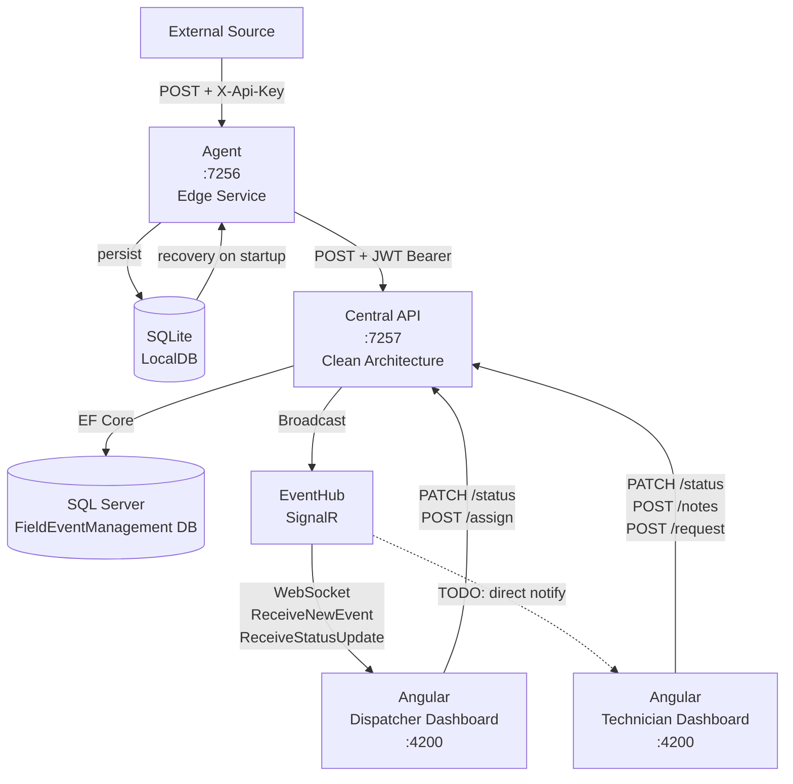
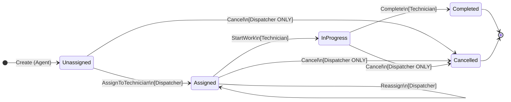

# Architecture Document – Field Event Management System

> **Version:** 1.1 | **Date:** July 2026 | **Author:** Lead Architect

---

## AI Tools Used

| Phase | Tool | Usage |
|-------|------|-------|
| **Architecture planning** | **Google Gemini** | System architecture design, architectural decisions, layer definitions, and State Machine |
| **Code writing** | **Cursor** | Implementation of all code — API server, Agent, Angular, tests |

> The architecture was planned together with Gemini; the code was written with the assistance of Cursor IDE.

---

## Exam Requirements Coverage

The following document addresses all 8 required sections and goes beyond what was asked:

| # | Exam Requirement | Status | Section |
|---|-----------------|--------|---------|
| 1 | Full system architecture diagram | ✅ Included | §1 — ASCII + Mermaid flowchart |
| 2 | Description of each component and its role | ✅ Included | §2 — All 7 components with tables |
| 3 | Detailed Agent description (event reception + server communication) | ✅ Included | §3 — Full ASCII diagram + Recovery |
| 4 | State Machine – states and transition diagram | ✅ Included | §4 — Mermaid stateDiagram + table |
| 5 | Data model (ERD / table description) | ✅ Included | §5 — SQL Server ERD + SQLite |
| 6 | Security and authentication mechanism | ✅ Included | §6 — Auth diagram + JWT + vulnerabilities |
| 7 | Behavior when a component is unavailable | ✅ Included | §7 — 5 failure scenarios + resilience table |
| 8 | Trade-offs and choices | ✅ Included | §8 — 8 reasoned decisions |

### What I Added Beyond the Explicit Requirements

| Addition | Where | Value |
|----------|-------|-------|
| **Detailed Audit Trail** | §4.4 | Explanation of why History is part of the Aggregate, not a standalone table |
| **Security Vulnerability Table** | §6.4 | Analysis of 5 known vulnerabilities with severity levels (🔴🟠🟡) |
| **Recovery on Restart** | §3.4 | Description of the SQLite recovery mechanism on restart |
| **Client-Side State Machine Mirror** | §4.4 | Explanation of the TypeScript mirror choice + difference from server "truth" |
| **SignalR JWT via query string** | §6.3 | Code snippet + explanation of why this is required in WebSocket |
| **Bounded Channel** | §8.4 | Rationale for choosing bounded over Unbounded + overflow behavior |
| **Production Readiness Appendix** | End of document | List of 10 actions required to move to a Production environment |
| **Gap / WIP Analysis** | §2 (notes) | Marking what is a stub/TODO in existing code + role inconsistency |

---

## Table of Contents

1. [Full Architecture Diagram](#1-full-architecture-diagram)
2. [Component Descriptions](#2-component-descriptions)
3. [Detailed Agent Description](#3-detailed-agent-description)
4. [Event State Machine](#4-event-state-machine)
5. [Data Model](#5-data-model)
6. [Security & Authentication](#6-security--authentication)
7. [Behavior on Component Failure](#7-behavior-on-component-failure)
8. [Trade-offs & Architectural Choices](#8-trade-offs--architectural-choices)

---

## 1. Full Architecture Diagram

```
╔══════════════════════════════════════════════════════════════════════════════════╗
║                        FIELD EVENT MANAGEMENT SYSTEM                            ║
╠══════════════════════════════════════════════════════════════════════════════════╣
║                                                                                  ║
║   ┌─────────────────────────────┐                                                ║
║   │      External Source        │  (field device / external system)              ║
║   └─────────────┬───────────────┘                                                ║
║                 │ POST /api/agent/events                                          ║
║                 │ Header: X-Api-Key                                               ║
║                 ▼                                                                 ║
║   ┌─────────────────────────────────────────────────────────┐                   ║
║   │                   AGENT (Edge Service)                   │ :7256             ║
║   │                                                         │                   ║
║   │  ┌──────────────┐   ┌───────────────┐  ┌────────────┐  │                   ║
║   │  │ Minimal API  │──▶│ EventChannel  │─▶│Background  │  │                   ║
║   │  │  Endpoint    │   │ (in-memory    │  │  Worker    │  │                   ║
║   │  └──────────────┘   │   Channel)    │  └─────┬──────┘  │                   ║
║   │                     └───────┬───────┘        │         │                   ║
║   │                             │ persist        │ forward │                   ║
║   │                     ┌───────▼───────┐        │         │                   ║
║   │                     │    SQLite     │        │         │                   ║
║   │                     │  (LocalDB)    │        │         │                   ║
║   │                     └───────────────┘        │         │                   ║
║   └───────────────────────────────────────────────┼─────────┘                   ║
║                                                   │ POST /api/events/receiveEvent ║
║                                                   │ Bearer JWT (Scheduler role)  ║
║                                                   ▼                             ║
║   ┌─────────────────────────────────────────────────────────────────────┐       ║
║   │                    CENTRAL API (Clean Architecture)                  │ :7257 ║
║   │                                                                     │       ║
║   │  ┌──────────────────────────────────────────────────────────────┐  │       ║
║   │  │  Presentation Layer  (Controllers)                           │  │       ║
║   │  │  AuthController | EventsController | TechnicianController    │  │       ║
║   │  └────────────────────────────┬─────────────────────────────────┘  │       ║
║   │                               │                                    │       ║
║   │  ┌────────────────────────────▼─────────────────────────────────┐  │       ║
║   │  │  Application Layer  (Use Cases)                              │  │       ║
║   │  │  EventReceiverService | TechnicianEventService               │  │       ║
║   │  └────────────────────────────┬─────────────────────────────────┘  │       ║
║   │                               │                                    │       ║
║   │  ┌────────────────────────────▼─────────────────────────────────┐  │       ║
║   │  │  Domain Layer  (Core)                                        │  │       ║
║   │  │  FieldEvent (Aggregate) | State Machine | EventStateHistory  │  │       ║
║   │  └────────────────────────────┬─────────────────────────────────┘  │       ║
║   │                               │                                    │       ║
║   │  ┌────────────────────────────▼─────────────────────────────────┐  │       ║
║   │  │  Infrastructure Layer                                        │  │       ║
║   │  │  EF Core → SQL Server | TokenService | EventHub (SignalR)    │  │       ║
║   │  └──────────────────────────────────────────────────────────────┘  │       ║
║   └─────────────────────────────────────────────────────┬───────────────┘       ║
║                                                         │                       ║
║           ┌─────────────────────────────────────────────┤                       ║
║           │ REST (HTTP/JSON)              SignalR (WS)  │                       ║
║           ▼                                    ▼        │                       ║
║   ┌──────────────────────────────────────────────────────┐                      ║
║   │              ANGULAR SPA (Frontend)   :4200          │                      ║
║   │                                                      │                      ║
║   │  ┌────────────────────┐  ┌──────────────────────┐   │                      ║
║   │  │  Dispatcher        │  │  Technician          │   │                      ║
║   │  │  Dashboard         │  │  Dashboard           │   │                      ║
║   │  └────────────────────┘  └──────────────────────┘   │                      ║
║   │  AuthService | SignalRService | EventStore (signals) │                      ║
║   └──────────────────────────────────────────────────────┘                      ║
╚══════════════════════════════════════════════════════════════════════════════════╝
```

### Simplified Communication Diagram (Mermaid)



---

## 2. Component Descriptions

### 2.1 `FieldEventManagement.Core` — Domain Layer

**Role:** The heart of the system. Contains pure business logic with no infrastructure dependencies.

| Element | Description |
|---------|-------------|
| `FieldEvent` | The Aggregate Root. Contains the full lifecycle of a field event — from creation, through assignment and status updates, to completion. The State Machine is built into it. |
| `EventStatus` | Enum representing all possible event states: `Unassigned`, `Assigned`, `InProgress`, `Completed`, `Cancelled`. |
| `EventStateHistory` | Entity that records every state transition — an immutable Audit Trail. |
| `User` | User entity with username, password, and role. |
| `InvalidFieldEventStateException` | Domain exception thrown on an illegal state transition. |
| `ITokenService`, `IUserRepository` | Interfaces (Ports) for the JWT service and user repository. |

**Architectural principle:** Zero dependency on external packages (`net10.0` only). This layer knows nothing about databases, HTTP, or SignalR.

---

### 2.2 `FieldEventManagement.Application` — Application Layer (Use Cases)

**Role:** Coordinates business flows. Translates Controller requests into Domain operations.

| Element | Description |
|---------|-------------|
| `EventReceiverService` | Receives events from the Agent: idempotency check → create `FieldEvent` → save → SignalR notification. |
| `TechnicianEventService` | Handles technician actions: status update, add note, assignment request. |
| `IFieldEventRepository` | Port for saving and retrieving events from DB. |
| `IRealTimeNotificationService` | Port for SignalR broadcasts — the Application layer has no direct SignalR dependency. |
| `DTOs` | Data transfer objects: `FieldEventDto`, `UpdateStatusDto`, `AddNoteDto`, `WrappedEvent`, `ProcessResult`. |

---

### 2.3 `FieldEventManagement.Infrastructure` — Infrastructure Layer

**Role:** Implements the interfaces defined in Application and Core. This is where the system "touches" the outside world.

| Element | Description |
|---------|-------------|
| `ApplicationDbContext` | EF Core DbContext. Defines mappings to `FieldEvents`, `Users`, `EventStateHistory` tables. History is loaded as a shadow field (`_history`) to protect the aggregate. |
| `FieldEventRepository` | Implements `IFieldEventRepository`. Supports `ExistsAsync`, `GetByIdAsync`, `AddAsync`. |
| `UserRepository` | Retrieves user by username. |
| `TokenService` | Generates JWT with Claims (Name, Role) and symmetric signature. |
| `RealTimeNotificationService` | Implements `IRealTimeNotificationService`. Translates business calls into SignalR broadcasts. |
| `EventHub` | SignalR Hub. WebSocket connection endpoint. `[Authorize]` requires a valid JWT on connection. |
| `DependencyInjection` | Extension method that registers all Infrastructure services in the DI Container. |

---

### 2.4 `FieldEventManagement.API` — Presentation Layer

**Role:** Exposes Use Cases as an HTTP API. Manages DI, auth, CORS, and SignalR wiring.

| Element | Description |
|---------|-------------|
| `AuthController` | `POST /api/auth/login` — authenticates user and returns JWT. |
| `EventsController` | `POST /api/events/receiveEvent` — receives events from the Agent (requires `Scheduler` role). |
| `TechnicianController` | Manages technician actions: status update, add note, assignment request. |
| `Program.cs` | Composition Root: EF `EnsureCreated`, JWT auth, CORS, SignalR, Polly (via Infrastructure). |

---

### 2.5 `FieldEventManagement.Agent` — Edge Service

See Section 3 for full details.

---

### 2.6 `field-event-app` — Angular SPA

**Role:** User interface for dispatcher and technician.

| Element | Description |
|---------|-------------|
| `AuthService` | Login and JWT storage in localStorage. |
| `SignalRService` | WebSocket connection to `/eventHub`. Listens to `ReceiveNewEvent` and passes it to the store. |
| `EventStore` | Local state store based on Angular Signals. Centralizes the event list. |
| `EventFacade` | Screen between Components and services/store. Simplifies the API for components. |
| `EventStateMachine` | TypeScript mirror that replicates server-side transition logic — enables client-side pre-validation only. |
| `AuthGuard` | Protects secured routes. |

---

### 2.7 Test Layers

| Project | Tests |
|---------|-------|
| `FieldEventManagement.Core.Tests` | 13 xUnit tests: valid/invalid state transitions, cancellation with/without permission, technician assignment. |
| `event-state-machine.spec.ts` | Jasmine tests for the TypeScript State Machine mirror. |

---

## 3. Detailed Agent Description

The Agent is an independent Edge Service (ASP.NET Core Hosted Service) whose role is to bridge external event sources to the Central API. It is designed to operate even when the API is unavailable.

### 3.1 Agent Architecture

```
 ┌──────────────────────────────────────────────────────────────────┐
 │                     Agent Process (:7256)                        │
 │                                                                  │
 │  ┌────────────────────────────────┐                              │
 │  │     Minimal API Endpoint       │                              │
 │  │  POST /api/agent/events        │                              │
 │  │  ① Validate X-Api-Key         │                              │
 │  │  ② Deserialize FieldEventDto   │                              │
 │  │  ③ EventChannel.AddEventAsync  │                              │
 │  │  ④ Return 202 Accepted         │                              │
 │  └───────────────┬────────────────┘                              │
 │                  │                                               │
 │                  ▼                                               │
 │  ┌────────────────────────────────────────────────────────────┐  │
 │  │                     EventChannel                           │  │
 │  │                                                            │  │
 │  │  AddEventAsync(dto):                                       │  │
 │  │    1. Wrap → WrappedEvent { Id=Guid.NewGuid(), Data=dto }  │  │
 │  │    2. SQLite INSERT (Status=Pending)          ──────────┐  │  │
 │  │    3. Channel.Writer.TryWrite(wrappedEvent)             │  │  │
 │  │                                                         │  │  │
 │  │  On Startup Recovery:                         ┌─────────┘  │  │
 │  │    SELECT * WHERE Status='Pending'             │            │  │
 │  │    → re-enqueue into Channel                  ▼            │  │
 │  │                                         ┌──────────┐       │  │
 │  │  ConfirmDelivery(id):                   │  SQLite  │       │  │
 │  │    → DELETE from LocalEvents            │ LocalDB  │       │  │
 │  │                                         └──────────┘       │  │
 │  │  MoveToError(id):                                          │  │
 │  │    → UPDATE Status='Error'                                 │  │
 │  └────────────────────────────┬───────────────────────────────┘  │
 │                               │ Channel.Reader                    │
 │                               ▼                                   │
 │  ┌────────────────────────────────────────────────────────────┐  │
 │  │              AgentBackgroundWorker                         │  │
 │  │                                                            │  │
 │  │  await foreach (event in Channel):                         │  │
 │  │    ProcessSingleEventWithRetryAsync(event)                 │  │
 │  │      ├─ attempt 1 → wait 10s on fail                       │  │
 │  │      ├─ attempt 2 → wait 30s on fail                       │  │
 │  │      ├─ attempt 3 → wait 60s on fail                       │  │
 │  │      └─ attempt 4+ → wait 5min on fail (cap)               │  │
 │  │                                                            │  │
 │  │  HTTP 2xx → ConfirmDelivery (DELETE SQLite)                │  │
 │  │  HTTP 400/422 → MoveToError (poison message)               │  │
 │  │  HTTP 5xx → retry with backoff                             │  │
 │  │  Network error → retry with backoff                        │  │
 │  │                                                            │  │
 │  │  Parallel: RunCleanupLoopAsync                             │  │
 │  │    every 24h → DELETE expired Error/Completed rows         │  │
 │  └────────────────────────────┬───────────────────────────────┘  │
 │                               │                                   │
 └───────────────────────────────┼───────────────────────────────────┘
                                 │ HTTPS POST
                                 ▼
                ┌──────────────────────────────┐
                │         BackendClient         │
                │  SendEventToBackendAsync()    │
                │  ↑ JwtAuthHandler             │
                │    (auto-login, cache JWT,    │
                │     retry on 401)             │
                │  ↑ AddStandardResilienceHandler│
                │    (Polly: timeouts, retries) │
                └──────────────────────────────┘
```

### 3.2 How the Agent Receives Events

1. **Reception:** An external source sends `POST /api/agent/events` with the `X-Api-Key` header.
2. **Validation:** The Minimal API verifies that the key matches `AgentSettings:ExpectedApiKey`.
3. **Wrapping:** The DTO is wrapped in a `WrappedEvent` with a unique `Guid` (for idempotency) and a timestamp.
4. **Pre-save:** The record is saved to SQLite with `Status=Pending` **before** being inserted into the in-memory queue.
5. **Enqueue:** `Channel.Writer.TryWrite()` enables asynchronous reading by the `BackgroundWorker`.
6. **Response:** HTTP 202 is returned immediately — the Agent does not "wait" for the API to succeed.

### 3.3 How the Agent Communicates with the Server

| Step | Action |
|------|--------|
| **Auth** | `JwtAuthHandler` (DelegatingHandler) automatically connects to `/api/auth/login` using credentials from `BackendAuth:Username/Password`. Caches the JWT. |
| **Send** | `BackendClient.SendEventToBackendAsync()` sends `POST /api/events/receiveEvent` with the `WrappedEvent` as JSON. |
| **Retry on 401** | If the JWT expires, `JwtAuthHandler` refreshes it automatically and retries. |
| **Polly** | `AddStandardResilienceHandler()` adds Retry, Timeout, and Circuit Breaker at the HttpClient level. |
| **Backoff** | `AgentBackgroundWorker` manages independent Exponential Backoff: 10s → 30s → 60s → 5min. |

### 3.4 Recovery on Restart

When the Agent starts after a crash/restart, `EventChannel` retrieves all records with `Status=Pending` from SQLite and re-enqueues them. This means **no data loss** even if the Agent crashed between receiving an event and sending it.

#### Cleanup Mechanism

`RunCleanupLoopAsync` runs a deletion every 24 hours, deleting **only** rows with:
- `Status = Error` older than `DeleteErrorAfterHours` (default: 168 hours = 7 days)
- `Status = Completed` older than `DeleteCompletedAfterHours` (default: 24 hours)

Rows with `Status = Pending` are **never deleted** — they remain on disk until successfully sent.

> **Production Note:** In Production it is recommended to add monitoring for growing `Error` rows, an Alert if the `Error` count exceeds a defined threshold, and a dedicated Dead Letter Queue for persistently failing events.

---

## 4. Event State Machine

### 4.1 States

| State | Meaning |
|-------|---------|
| `Unassigned` | **Initial state.** Event received but not yet assigned to a technician. |
| `Assigned` | Assigned to a specific technician. Can be reassigned (Assigned→Assigned). |
| `InProgress` | The technician has started work. |
| `Completed` | Work is complete. **Terminal state.** |
| `Cancelled` | Event was cancelled. **Terminal state.** Only Dispatcher is authorized. |

### 4.2 Transition Diagram



### 4.3 Transition Rules (Table)

| From / To | Unassigned | Assigned | InProgress | Completed | Cancelled |
|-----------|-----------|---------|-----------|-----------|----------|
| **Unassigned** | — | ✅ | ❌ | ❌ | ✅ * |
| **Assigned** | ❌ | ✅ (re-assign) | ✅ | ❌ | ✅ * |
| **InProgress** | ❌ | ❌ | — | ✅ | ✅ * |
| **Completed** | ❌ | ❌ | ❌ | — | ❌ |
| **Cancelled** | ❌ | ❌ | ❌ | ❌ | — |

> ✅ * Cancellation is allowed **only** when `actingRole == "Dispatcher"` (case-insensitive). Any cancellation attempt by another role throws `InvalidFieldEventStateException`.

### 4.4 Architectural Enforcement

- **Logic location:** Exists **only** in `FieldEvent.TransitionTo()` in the Core layer.
- **`private set` on all Properties:** Prevents direct external state mutation — changes can only be made through `TransitionTo` and `AssignToTechnician`.
- **Audit Trail:** Every state transition adds a record to `EventStateHistory` with `ChangedBy` and a timestamp.
- **Client-side mirror:** `EventStateMachine` in TypeScript (Angular) replicates the transition table for pre-validation only — the server is always the "source of truth."

---

## 5. Data Model

### 5.1 ERD

```
┌──────────────────────────────────────────────────────────────────┐
│                        SQL Server DB                             │
│                                                                  │
│  ┌──────────────────────────────┐                               │
│  │          FieldEvents          │                               │
│  ├──────────────────────────────┤                               │
│  │ Id              UNIQUEIDENTIFIER  PK                         │
│  │ Title           NVARCHAR(200)     NOT NULL                   │
│  │ Description     NVARCHAR(MAX)                                │
│  │ Source          NVARCHAR(MAX)                                │
│  │ Location        NVARCHAR(MAX)                                │
│  │ Status          INT               NOT NULL  (0-4 = enum)    │
│  │ AssignedTech.Id NVARCHAR(MAX)     NULL                       │
│  │ CreatedAt       DATETIME2         NOT NULL                   │
│  └──────────────────┬───────────────┘                           │
│                     │ 1                                          │
│                     │ N                                          │
│  ┌──────────────────▼───────────────┐                           │
│  │       EventStateHistory          │                           │
│  ├──────────────────────────────────┤                           │
│  │ Id             UNIQUEIDENTIFIER  PK                          │
│  │ FieldEventId   UNIQUEIDENTIFIER  FK → FieldEvents.Id         │
│  │ Status         INT               NOT NULL                    │
│  │ ChangedBy      NVARCHAR(MAX)     NOT NULL                    │
│  │ Timestamp      DATETIME2         NOT NULL                    │
│  └──────────────────────────────────┘                           │
│                                                                  │
│  ┌──────────────────────────────┐                               │
│  │            Users             │                               │
│  ├──────────────────────────────┤                               │
│  │ Id           UNIQUEIDENTIFIER  PK                            │
│  │ Username     NVARCHAR(MAX)     NOT NULL  (unique assumed)     │
│  │ PasswordHash NVARCHAR(MAX)     NOT NULL                      │
│  │ Role         NVARCHAR(MAX)     NOT NULL  (Scheduler|Tech.)   │
│  └──────────────────────────────┘                               │
└──────────────────────────────────────────────────────────────────┘

┌──────────────────────────────────────────────────────────────────┐
│                     SQLite DB (Agent)                            │
│                                                                  │
│  ┌──────────────────────────────┐                               │
│  │         LocalEvents          │                               │
│  ├──────────────────────────────┤                               │
│  │ Id        TEXT  PK  (Guid)                                   │
│  │ Payload   TEXT  NOT NULL  (JSON: WrappedEvent)               │
│  │ Status    TEXT  NOT NULL  (Pending|Error|Completed)          │
│  │ CreatedAt TEXT  NOT NULL  (ISO 8601)                         │
│  └──────────────────────────────┘                               │
│  INDEX: IX_LocalEvents_Status_CreatedAt                         │
└──────────────────────────────────────────────────────────────────┘
```

### 5.2 Data Structure Explanation

**`FieldEvent`** is the Aggregate Root. `EventStateHistory` is an internal collection loaded via EF Core with a field-backed property (`_history`). The decision to include History as part of the Aggregate ensures every state transition is always accompanied by a history record — Atomic and inseparable.

**`Users`** — a simple table without FK to events. `AssignedTechnicianId` in `FieldEvent` is a string rather than an FK — a deliberate choice to allow flexibility (the ID may come from an external HR system).

**SQLite (Agent)** — local storage in JSON format for `WrappedEvent`. No complex schema — its sole purpose is durability for events in transit.

---

## 6. Security & Authentication

### 6.1 Security Diagram

```
External Source ──[X-Api-Key header]──────────────────▶ Agent
                                                        │
                                              validates against
                                         AgentSettings:ExpectedApiKey

Agent ──[POST /api/auth/login (username+password)]────▶ API / AuthController
                                                        │
                                              UserRepository.GetByUsernameAsync()
                                              compares PasswordHash == password
                                                        │
                                              TokenService.GenerateToken(user)
                                              HS256 JWT { Name, Role, exp }
                                                        │
                                              ◀── { token: "eyJ..." } ──────────

Agent ──[Authorization: Bearer <JWT>]─────────────────▶ EventsController
                                                        │ [Authorize(Roles="Scheduler")]

Angular ──[POST /api/auth/login]──────────────────────▶ AuthController
         ◀── { token } ──────────────────────────────── 
         stores in localStorage

Angular ──[Authorization: Bearer <JWT>]───────────────▶ TechnicianController
                                                        │ [Authorize(Roles="Technician")]

Angular ──[WebSocket + ?access_token=<JWT>]───────────▶ EventHub (SignalR)
                                                        │ [Authorize] at Hub level
                                                        │ invoke JoinSchedulerGroup()
                                                        │ [Authorize(Roles="Scheduler")]
```

### 6.2 JWT — Implementation Details

| Parameter | Value |
|-----------|-------|
| Algorithm | HMAC SHA-256 (symmetric) |
| Issuer / Audience | Not configured (vulnerability — see Trade-offs) |
| Token lifetime | 2 days (`AddDays(2)` in code) |
| Key | From `appsettings.json:Jwt:Key` (32 characters) |
| Claims | `ClaimTypes.Name` (Username), `ClaimTypes.Role` (Scheduler/Technician) |

### 6.3 SignalR — WebSocket Connection Security

JWT cannot be sent in a Header over a WebSocket connection (browser limitation). Therefore the API extracts the token from the `?access_token=` query parameter. This is configured in `Program.cs`:

```csharp
options.Events = new JwtBearerEvents
{
    OnMessageReceived = context =>
    {
        var token = context.Request.Query["access_token"];
        var path = context.HttpContext.Request.Path;
        if (!string.IsNullOrEmpty(token) && path.StartsWithSegments("/EventHub"))
            context.Token = token;
        return Task.CompletedTask;
    }
};
```

### 6.4 Intentional Dev-Only Decisions

> **Note:** This project is a **development and test environment only**. All exposed passwords, keys, and credentials are intentional DEV values. The following decisions are appropriate for this environment and do not represent architectural weaknesses.

| Choice | Location | Dev Context Explanation | Production Change |
|--------|----------|------------------------|-------------------|
| `PasswordHash == password` (plain-text) | `UserRepository` | Convenient for development — users can be added directly to DB without hashing | BCrypt/Argon2 |
| JWT Key in `appsettings.json` | `appsettings.json` | Enables immediate startup without secret configuration | Azure Key Vault / env vars |
| `InsecureClient` (SSL bypass) | `Agent/Program.cs` | Required in dev because `localhost:7257` certificate is self-signed | Removed in production — code already conditions: `if (IsDevelopment())` |
| `BackendAuth` credentials in appsettings | `appsettings.json` | The Agent needs credentials to login — convenient in dev | env vars / secrets store |
| Issuer/Audience configured (correct) | `TokenService` | ✅ `ValidateIssuer=true`, `ValidateAudience=true` — already configured correctly | No change needed |

---

## 7. Behavior on Component Failure

### 7.1 Central API Failure

**Impact:** The Agent cannot send events.

**Resilience mechanism:**

1. The Agent continues receiving events from external sources (HTTP 202 returned immediately).
2. Every event is saved to SQLite with `Status=Pending` **before** being enqueued.
3. `AgentBackgroundWorker` retries with Exponential Backoff: 10s → 30s → 60s → 5min.
4. The Channel is Bounded (limit from `ChannelCapacity: 10000`). If full, `TryWrite` fails.
5. When the API returns — the Worker automatically continues sending all pending events.
6. If the Agent itself goes down during this time — **Recovery on startup**: SQLite is not deleted; on restart all `Pending` events are re-enqueued.

```
API down ─────────────────────────────────── API returns
    │                                              │
    ▼                                              ▼
Agent: SQLite.Pending + Backoff ────────── Worker resumes sending
```

---

### 7.2 Agent Failure

**Impact:** New events are not received from the external source.

**Resilience mechanism:**

1. The API continues operating — existing events can be managed by technicians.
2. After restart — the Agent recovers all `Pending` events from SQLite.

---

### 7.3 SQL Server (Central DB) Failure

**Impact:** The API cannot read/write events.

**Resilience mechanism:**

1. The API returns 500 for requests that require DB access.
2. The Agent receives 5xx → activates backoff and retries.
3. No read-through cache — no full resilience on the read path.
4. After DB recovery — the API resumes, the Agent sends pending events.

---

### 7.4 SignalR / EventHub Failure

**Impact:** Real-time updates do not reach Angular.

**Resilience mechanism:**

1. The failure **does not affect** event reception from the Agent (SignalR notification is fire-and-forget in `EventReceiverService`).
2. The Angular client uses `withAutomaticReconnect()` — retries connection automatically.
3. Updates that occurred during the disconnect **are not received** — no catch-up/sync mechanism. In Production: a polling endpoint or SSE fallback would be required.

---

### 7.5 Angular (Client) Failure

**Impact:** Users cannot access the UI. The API, Agent, and DB continue operating unaffected.

---

### 7.6 Resilience Summary

| Scenario | Data Loss | Continued Reception | Auto-Recovery |
|----------|-----------|--------------------|-|
| API down | ❌ None | ✅ Agent continues | ✅ Yes (backoff) |
| Agent down | ❌ None (SQLite) | ❌ Stopped | ✅ Yes (recovery) |
| SQL Server down | ❌ None | ❌ Stopped | ✅ Yes |
| SignalR down | ❌ None | ✅ Continues | ✅ (AutoReconnect) |
| Angular down | ❌ None | ✅ Continues | ✅ (Browser reload) |

---

## 8. Trade-offs & Architectural Choices

### 8.0 Alternatives Analysis — Key Architectural Decisions

---

#### A. Agent Architecture: Background Worker with SQLite — vs. Alternatives

##### Alternatives Considered

**Alternative 1: Message Queue (RabbitMQ / Azure Service Bus / Kafka)**

```
External → RabbitMQ Queue → Consumer Service → API
```

| Advantage | Disadvantage |
|-----------|-------------|
| Built-in Dead Letter Queue | Dependency on external infrastructure — RabbitMQ/Kafka must be running |
| Horizontal scaling (multiple consumers) | High operational complexity — not suitable for Edge devices |
| Ordering guarantees (Kafka) | Edge device must have connectivity to central infrastructure at all times |
| Fan-out to multiple services | No local storage — if the network is unavailable, the queue is unreachable |

**Alternative 2: Python Agent**

```python
# agent.py
import sqlite3, requests, time

def run():
    while True:
        events = db.get_pending()
        for e in events:
            try: 
                requests.post(API_URL, json=e)
                db.confirm(e.id)
            except: 
                time.sleep(30)
```

| Advantage | Disadvantage |
|-----------|-------------|
| Quick to write | No type safety, no DI, no layer separation |
| Familiar `requests` library | No IHostedService — must manage thread pool manually |
| Fast scripting | Packaging for Edge devices more complex than .NET single binary |
| Not necessarily better at concurrency | `asyncio` is elegant but adds complexity to error handling |

> **Note:** Python Agent was presented as a theoretical alternative for comparison. I have no practical Python experience, so this is not a comparison based on personal experience — it is an analysis of language and platform-level pros and cons.

**Alternative 3 (My Choice): .NET Background Worker + SQLite**

```
External → Minimal API → EventChannel → SQLite (Persist) → BackgroundWorker → API
                                      ↘ in-memory Channel ↗
```

| Advantage | Rationale |
|-----------|-----------|
| **Self-contained** | The Agent is a single binary with no external infrastructure dependency |
| **Built-in Durability** | SQLite on local disk — works even without network |
| **Type Safety** | Same language as the API — compiled DTO, not string parsing |
| **`IHostedService`** | .NET manages the lifecycle (startup, graceful shutdown, cancellation) |
| **Exponential Backoff** | Graduated retry logic without external libraries |
| **Recovery on Restart** | SQLite survives crashes — `GetPendingEvents()` returns everything |
| **Circuit Breaker (Polly)** | Built into `AddStandardResilienceHandler` — no extra code |

**Conclusion:** For an Edge Agent designed to work offline, the Background Worker with SQLite provides **all** the benefits of a Message Queue (durability, retry, DLQ) — without infrastructure dependency. Python can achieve the same result but requires more "manual" work — no DI, no hosted service lifecycle, no Polly.

---

#### B. SQLite as Local Storage — vs. Alternatives

##### Alternatives Considered

**Alternative 2: JSON File / Text File**

```csharp
// append to file
File.AppendAllText("events.jsonl", JsonSerializer.Serialize(event) + "\n");
```

| Advantage | Disadvantage |
|-----------|-------------|
| Simple | No atomicity — crash during write can corrupt the file |
| Human-readable | No transactions, no index, linear scan for every recovery |
| No dependency | No UPDATE/DELETE mechanism — must be implemented manually |

**Alternative 3 (My Choice): SQLite**

```sql
CREATE TABLE LocalEvents (
    Id TEXT PRIMARY KEY,
    Payload TEXT NOT NULL,
    Status TEXT NOT NULL,  -- Pending | Error | Completed
    CreatedAt TEXT NOT NULL
);
CREATE INDEX IX_LocalEvents_Status_CreatedAt ON LocalEvents (Status, CreatedAt);
```

| Advantage | Rationale |
|-----------|-----------|
| **Atomic transactions** | INSERT + status update are transactional — no partial writes |
| **WAL mode** | Write-Ahead Log enables fast writes and concurrent reads |
| **SELECT/UPDATE/DELETE** | Built-in status management without custom code |
| **Index** | `IX_LocalEvents_Status_CreatedAt` — fast recovery even with 100K rows |
| **Zero server** | Single file on disk, no separate process required |
| **Cross-platform** | `Microsoft.Data.Sqlite` — works on Windows/Linux/ARM |

**Conclusion:** SQLite provides everything needed for the Agent's durability layer — atomic writes, built-in status management, fast recovery — at zero infrastructure cost. The natural choice for any Edge device.

---

#### C. Clean Architecture — vs. Alternatives

##### 3 Approaches Considered

**Approach 1: Traditional Layered Architecture (Classic)**

```
┌─────────────────────────────┐
│   Presentation (Controllers)│
├─────────────────────────────┤
│   Business Logic (Services) │
├─────────────────────────────┤
│   Data Access (Repositories)│
├─────────────────────────────┤
│   Database                  │
└─────────────────────────────┘
```

| Advantage | Disadvantage |
|-----------|-------------|
| Simple and familiar | DB layer "leaks" upward — Domain cannot execute logic without DB |
| Fast initial development | Tests require a real DB or complex mocking |
| | **State Machine lives in Service** — not in Domain, hard to test |
| | Inverted dependency: Domain depends on Infrastructure |

**Approach 2: Vertical Slice Architecture**

```
┌──────────────┐  ┌──────────────┐  ┌──────────────┐
│ReceiveEvent/ │  │UpdateStatus/ │  │  AddNote/    │
│  Command.cs  │  │  Handler.cs  │  │  Handler.cs  │
│  Handler.cs  │  │  Validator   │  │  Validator   │
│  Validator   │  │  Repository  │  │  Repository  │
│  Repository  │  └──────────────┘  └──────────────┘
└──────────────┘
```

| Advantage | Disadvantage |
|-----------|-------------|
| Each feature is independent — change without breaking others | **Code sharing** between slices requires skill — tends toward duplication |
| Easy to locate code by feature | State Machine — where does it live? In each handler separately? |
| Very well suited to mediator (MediatR) | Global responsibility (auth, logging) less clear |
| Scales well in large teams | Complex to explain to those unfamiliar with the approach |

**Approach 3 (My Choice): Clean Architecture**

```
Core (Domain)          ← zero dependencies
    ↑
Application            ← depends only on Core
    ↑
Infrastructure         ← implements interfaces from Application/Core
    ↑
API (Presentation)     ← assembles everything
```

**What makes it unique in this project:**

| Decision | Code Expression | Rationale |
|----------|----------------|-----------|
| **State Machine in Core** | `FieldEvent.TransitionTo()` in `Core` project | Test Domain without DB or HTTP |
| **Ports & Adapters** | `IFieldEventRepository`, `IRealTimeNotificationService` | Application doesn't know about EF Core or SignalR |
| **Domain Exceptions** | `InvalidFieldEventStateException` in Core | Exception speaks in business language, not technical |
| **Aggregate Protection** | `private set` on all Properties | Cannot break State Machine from outside |

**Direct comparison with other approaches:**

| Criterion | Traditional | Vertical Slice | Clean Architecture |
|-----------|-------------|---------------|-------------------|
| Test State Machine without DB | ❌ | ⚠️ | ✅ |
| Separate Domain from Infrastructure | ❌ | ⚠️ | ✅ |
| Easy to add new feature | ✅ | ✅ | ⚠️ |
| Flexibility to swap DB/SignalR | ❌ | ⚠️ | ✅ |
| Fast onboarding to project | ✅ | ⚠️ | ⚠️ |
| Suited for complex State Machine | ❌ | ⚠️ | ✅ |

**Conclusion:** Clean Architecture wins here **because of the State Machine**. When the Domain is rich — with Aggregate Roots, history, validation rules — it must live in a dependency-free layer. Vertical Slice would require duplicating the State Machine in every handler; Traditional would place it in a Service that depends on DbContext.

---

### 8.1 Clean Architecture vs. Simplicity

**Choice:** Clean Architecture with 4 layers (Core → Application → Infrastructure → API).

**Rationale:** The requirements include a complex State Machine, real-time communication, and an Edge Agent. Separating the Domain from the infrastructure enables:

- Testing the State Machine without DB (tests in `Core.Tests` do not require Entity Framework).
- Replacing SignalR with gRPC streaming without changing Use Cases.
- Adding Kafka/RabbitMQ in Infrastructure without touching Core.

**Trade-off:** Additional boilerplate (DTOs, interfaces, extension methods). For a small project — possible over-engineering. For a growing project — the investment is justified.

---

### 8.3 Exponential Backoff in Agent vs. Message Queue (RabbitMQ/Kafka)

**Choice:** Built-in Backoff in the Worker (10s → 30s → 60s → 5min).

**Rationale:** Simplicity — no dependency on external infrastructure. Appropriate for an Edge environment with limited resources.

**Trade-off:** No formal Dead Letter Queue (only SQLite Error status). In Production with high volume — a Message Broker would provide DLQ, ordering guarantees, and horizontal scaling.

---

### 8.4 Bounded Channel vs. Unbounded

**Choice:** `ChannelCapacity: 10000` — bounded queue.

**Rationale:** Prevents memory exhaustion during prolonged API failure. When the queue is full, new events **are not discarded** — they are already in SQLite with `Status=Pending` and will wait for a restart or clearance.

**Trade-off:** Senders after the queue is full receive an error (if `TryWrite` fails). Future solution: configurable Overflow policy.

---

### 8.5 SignalR Groups ("Schedulers") vs. Direct User Connection

**Choice:** Broadcast to all dispatchers in the Group, not to a specific connection.

**Rationale:** Simple to implement and does not require managing UserId → ConnectionId mapping.

**Trade-off:** No direct broadcast to a specific technician (TODO in code). In Production: store `Dictionary<string, string> userIdToConnectionId` in the Hub or use SignalR User Groups.

---

### 8.6 EnsureCreated vs. Migrations

**Choice:** `Database.EnsureCreated()` on startup.

**Rationale:** Development simplicity — no migration file management required.

**Trade-off:** Not suitable for Production. Does not support schema evolution. In Production: `dotnet ef migrations add` + `migrate()` in the CI/CD pipeline.

---

### 8.7 JWT Symmetric Key vs. Asymmetric (RS256)

**Choice:** HMAC SHA-256 with a symmetric key.

**Rationale:** Simple for development. With a single API server — no benefit from asymmetric.

**Trade-off:** In Microservices / Multi-tenant — RS256 with a Public Key allows services to verify JWT without receiving the Secret Key.

---

### 8.8 Angular Signals (EventStore) vs. NgRx

**Choice:** `signal()` and `computed()` from the Angular 17 Signals API.

**Rationale:** Built-in, easy to understand, no external dependency. Sufficient for a project with simple local state.

**Trade-off:** NgRx adds DevTools, time-travel debugging, and structured effects. For a large project with complex state — NgRx is preferable.

---

## Appendix: Production Readiness Guidelines

| Topic | Required Action |
|-------|----------------|
| Passwords | Replace with BCrypt/Argon2 |
| JWT Secret | Move to Azure Key Vault / AWS Secrets Manager |
| SSL Agent | Remove `InsecureClient`, provide a valid certificate |
| DB Migrations | Switch from `EnsureCreated` to EF Migrations |
| Dispatcher role | Fix inconsistency: `Scheduler` vs `Dispatcher` |
| Token delivery | Add ConnectionId management for direct technician broadcasts |
| Note persistence | Implement DB storage (currently fire-and-forget SignalR only) |
| Angular HTTP calls | Implement the stubs in `EventFacade` |
| Monitoring | Add health checks, OpenTelemetry, Sentry/Application Insights |
| Auth routing | Route by role (Dispatcher/Technician) instead of always to `/dispatcher` |
